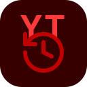
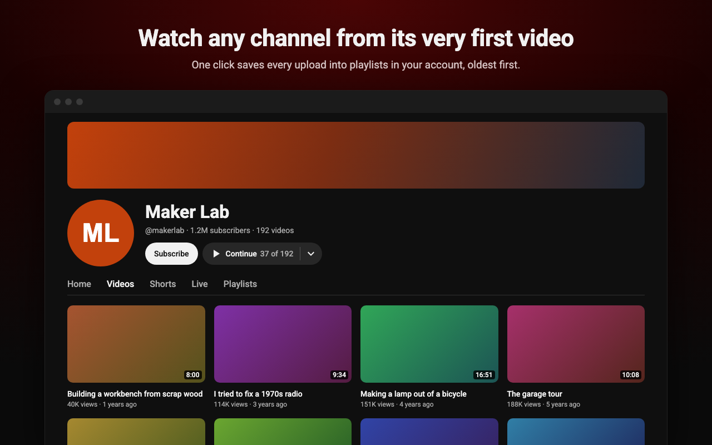

  
  <h1><code>yt-chronological</code></h1>
  
<strong>Watch any YouTube channel from its very first video</strong>

  
Saves every upload into playlists in your account, oldest first, and remembers where you left off.

  

    <a href="#install">Install</a> ·
    <a href="#using-it">Using it</a> ·
    <a href="CONTRIBUTING.md">Contributing</a>
  

## Install

Download the zip for your browser from the [latest release](https://github.com/kishannareshpal/yt-chronological/releases/latest) and unzip it.

- **Chrome, Arc, Brave, Edge:** open `chrome://extensions`, turn on Developer mode, click **Load unpacked** and pick the unzipped folder.
- **Firefox:** open `about:debugging#/runtime/this-firefox`, click **Load Temporary Add-on** and pick `manifest.json` in the unzipped folder. If the button does not show on YouTube, allow the extension on www.youtube.com from `about:addons`.

Developers can build from source instead. See [CONTRIBUTING.md](CONTRIBUTING.md).

## Requirements

- Chrome 111 or later (or another Chromium browser), or Firefox 128 or later
- Signed in to YouTube, because the playlists are saved to your account

## Using it

1. Open a channel page or any of its videos.
2. Click **Oldest first** next to Subscribe, or the extension's toolbar icon.
3. Pick what to include (Videos, Shorts, Live streams) and who can see the playlists, then save.

From then on the button next to Subscribe reads **Continue · 37 of 192** and takes you straight back to where you left off. The arrow beside it opens the details, where you can add new uploads, resume an interrupted save or manage the channels in a set.

- **Your place:** a video counts once you have watched 30 seconds of it, so opening the playlist at video 1 does not lose it. **Continue from video 37** also shows under Play all and beside the video.
- **Big channels:** a playlist holds up to 5,000 videos, so bigger channels are split into parts. The next part starts on its own when one ends.
- **Joining channels:** add a second channel to a set, from its details or from the new channel's setup, and everything is merged by publish date in your existing playlists. Each channel keeps its own choice of Videos, Shorts and Live streams, and can be removed again.

## Good to know

- It only talks to YouTube itself. There are no analytics, no servers and no accounts besides your own. See the [privacy policy](https://kishanjadav.com/yt-chronological/privacy/).
- Your place and saved sets live in this browser profile. Watching on your phone or TV does not move your place.
- Saving runs in the YouTube tab. Browsing around YouTube is fine, but closing the tab pauses it until you resume.
- It uses YouTube's own internal web API, the same one the site uses. It is undocumented, so a YouTube update could break it.

## Contributing

See [CONTRIBUTING.md](CONTRIBUTING.md).
